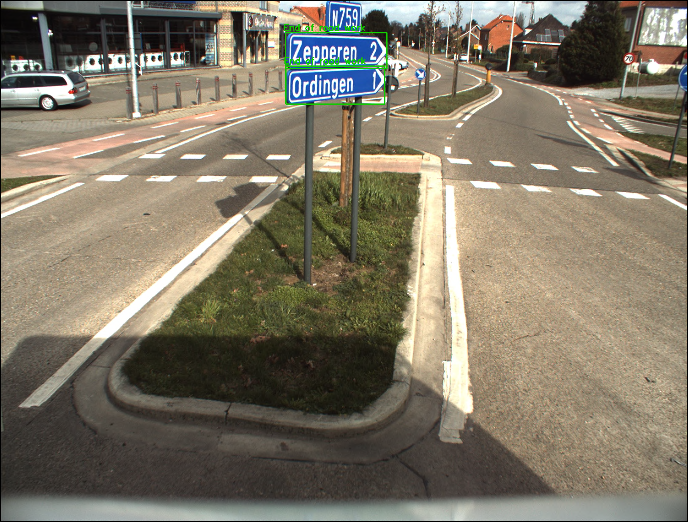
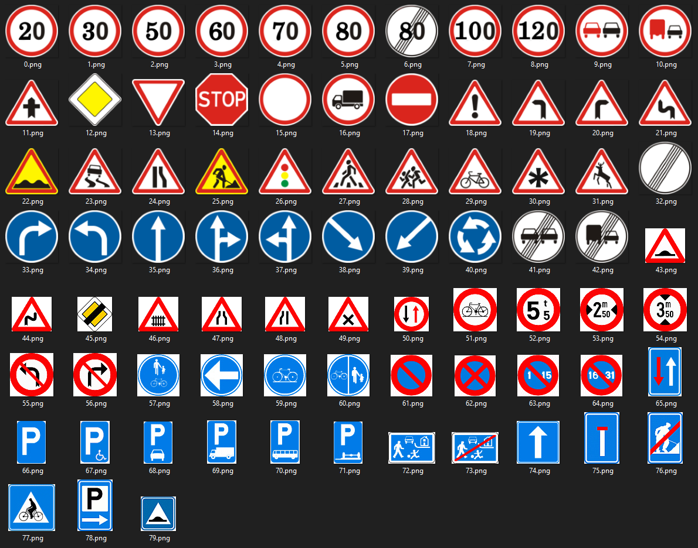

# Traffic sign recognition
This project uses deep learning to detect and recognize traffic signs in a road image.



## Introduction
The classifer is trainded on 80 different classes.


Two technologies are used :
* * YOLO "you only look once" to detect traffic signs.
* * Convolutional neural network to classify traffic signs.

## Installation
> The code is implemented in python3 using Pytorch and Opencv.
The web interface implemented using Stramlit.

To run the web interface:

1- install all the requirements
```bash
pip install -r requirements.txt
``` 
Or useto create a conda envirment
```bash
conda env create -f environment.yml
``` 

2- download the Yolo weights from [Google drive](https://drive.google.com/file/d/1_UcHkZqF-y58NNyNlR7AnZAY6snKAutW/view?usp=sharing)

3- put all files in the same directory

4- to run the web interface 
```bash
streamlit run web.py
``` 
